<div align="center">

# 🏥 Online Doctor Appointment System

### A Modern, Secure & Scalable Healthcare Management Platform

[](https://www.oracle.com/java/)
[](https://spring.io/projects/spring-boot)
[](https://reactjs.org/)
[](https://www.mysql.com/)
[](LICENSE)

[Features](#-features) • [Tech Stack](#-tech-stack) • [Installation](#-installation-guide) • [API Docs](#-api-endpoints) • [Screenshots](#-screenshots)

</div>

---

## 📋 Table of Contents

- [Problem Statement](#-problem-statement)
- [Solution](#-solution)
- [Features](#-features)
- [Tech Stack](#-tech-stack)
- [System Architecture](#-system-architecture)
- [Database Schema](#-database-schema)
- [Installation Guide](#-installation-guide)
- [Environment Variables](#-environment-variables)
- [API Endpoints](#-api-endpoints)
- [Project Structure](#-project-structure)
- [Screenshots](#-screenshots)
- [What Makes This Different](#-what-makes-this-project-different)
- [Future Enhancements](#-future-enhancements)
- [Contributing](#-contributing)
- [Creator](#-creator)

---

## 🎯 Problem Statement

### Day-to-Day Healthcare Challenges

In today's fast-paced world, patients and healthcare providers face several critical challenges:


**For Patients:**
- 📞 Long waiting times on phone calls to book appointments
- ⏰ Difficulty finding available doctors at convenient times
- 📝 No centralized system to track appointment history
- 🔍 Limited information about doctor qualifications and specializations
- ❌ Frequent appointment conflicts and double bookings
- 💬 Lack of transparency in doctor availability

**For Doctors:**
- 📅 Manual appointment scheduling leading to errors
- 📊 No efficient way to manage patient appointments
- ⏱️ Time wasted on administrative tasks
- 📉 Difficulty tracking consultation statistics

**For Healthcare Administrators:**
- 🔐 Limited oversight and control over the system
- 📈 No real-time analytics or reporting capabilities
- 🔍 Difficulty in monitoring system activities
- 📋 Manual data export and reporting processes

---

## 💡 Solution

My **Online Doctor Appointment System** provides a comprehensive digital solution that:

✅ **Streamlines Appointment Booking** - Patients can search, filter, and book appointments with doctors in real-time  
✅ **Eliminates Double Bookings** - Smart time slot reservation system prevents scheduling conflicts  
✅ **Enhances Transparency** - Complete doctor profiles with qualifications, ratings, and availability  
✅ **Automates Workflows** - Reduces administrative burden with automated notifications and reminders  
✅ **Provides Real-Time Updates** - WebSocket integration for instant appointment status changes  
✅ **Ensures Security** - JWT-based authentication with role-based access control  
✅ **Enables Data-Driven Decisions** - Comprehensive analytics dashboard for administrators  
✅ **Supports Scalability** - Microservices-ready architecture with database migration management  

### My Approach

1. **User-Centric Design** - Intuitive interfaces for patients, doctors, and administrators
2. **Security First** - Industry-standard encryption, secure authentication, and audit logging
3. **Performance Optimized** - Caching strategies, lazy loading, and code splitting
4. **Accessibility Compliant** - WCAG 2.1 AA standards with keyboard navigation and screen reader support
5. **Real-Time Communication** - WebSocket integration for live updates
6. **Comprehensive Testing** - Unit tests, integration tests, and property-based testing

---

## ✨ Features

### 👤 Patient Features

- 🔐 **Secure Registration & Login** - Email-based authentication with password strength validation
- 🔍 **Advanced Doctor Search** - Filter by specialty, experience, fees, ratings, and availability
- 📅 **Smart Appointment Booking** - Multi-step wizard with date/time selection and confirmation
- ⏰ **Time Slot Reservation** - Temporary hold on slots during booking process
- 📋 **Appointment Management** - View, reschedule, and cancel appointments
- 📊 **Personal Dashboard** - Overview of upcoming appointments and history
- 👤 **Profile Management** - Update personal information and upload avatar
- 🔔 **Real-Time Notifications** - Instant updates on appointment status changes
- ⭐ **Doctor Reviews** - Rate and review doctors after appointments
- 📱 **Responsive Design** - Seamless experience across desktop, tablet, and mobile

### 👨‍⚕️ Doctor Features

- 📅 **Availability Management** - Set weekly schedules and specific date availabilities
- 📋 **Appointment Dashboard** - View and manage all appointments in one place
- 👥 **Patient Management** - Access patient information and appointment history
- 📊 **Statistics & Analytics** - Track consultation metrics and performance
- 👤 **Enhanced Profile** - Showcase qualifications, experience, and specializations
- 📄 **Credential Management** - Upload and manage professional credentials
- ⭐ **Review Management** - View patient feedback and ratings
- 🔔 **Real-Time Updates** - Instant notifications for new appointments
- 📈 **Performance Metrics** - Track appointment completion rates and patient satisfaction

### 🔧 Admin Features

- 📊 **Comprehensive Dashboard** - Real-time system statistics and analytics
- 👥 **User Management** - Enable/disable users, bulk operations, and role management
- 👨‍⚕️ **Doctor Management** - Verify doctors, manage availability, and credentials
- 📅 **Appointment Oversight** - View and manage all system appointments
- 📈 **Advanced Analytics** - Appointment trends, user growth, and system health metrics
- 🔍 **Audit Logging** - Complete activity tracking with filtering and search
- 📤 **Data Export** - Export users, doctors, appointments, and audit logs (CSV, Excel, PDF)
- 🔔 **Real-Time Monitoring** - Live updates on system activities
- 🎯 **Bulk Operations** - Enable/disable multiple users or doctors simultaneously
- 📊 **Performance Reports** - Doctor performance metrics and system health indicators

---

## 🛠️ Tech Stack

### Frontend

| Technology | Version | Purpose |
|------------|---------|---------|
| **React** | 18.2.0 | UI library for building interactive interfaces |
| **Vite** | 4.5.0 | Fast build tool and development server |
| **Material-UI (MUI)** | 5.14.0 | Component library for modern UI design |
| **React Router** | 6.20.0 | Client-side routing and navigation |
| **Axios** | 1.6.0 | HTTP client for API communication |
| **Framer Motion** | 12.23.24 | Animation library for smooth transitions |
| **Recharts** | 3.4.1 | Charting library for data visualization |
| **date-fns** | 2.30.0 | Date manipulation and formatting |
| **SockJS & STOMP** | Latest | WebSocket client for real-time updates |
| **React Hot Toast** | 2.6.0 | Toast notifications |
| **Vitest** | 0.34.0 | Unit testing framework |
| **Cypress** | 13.6.0 | End-to-end testing |


**Frontend Architecture Highlights:**
- 🎨 **Component-Based Architecture** - Reusable, modular components
- 🚀 **Code Splitting** - Optimized bundle sizes with lazy loading
- 🎭 **Context API** - Global state management for auth, notifications, and themes
- ♿ **Accessibility First** - WCAG 2.1 AA compliant with ARIA labels
- 📱 **Responsive Design** - Mobile-first approach with breakpoints
- 🎬 **Smooth Animations** - Framer Motion for enhanced UX
- 🔄 **Real-Time Updates** - WebSocket integration for live data

### Backend

| Technology | Version | Purpose |
|------------|---------|---------|
| **Java** | 17 | Programming language |
| **Spring Boot** | 3.2.0 | Application framework |
| **Spring Security** | 3.2.0 | Authentication and authorization |
| **Spring Data JPA** | 3.2.0 | Database ORM and repository pattern |
| **Spring WebSocket** | 3.2.0 | Real-time bidirectional communication |
| **JWT (JJWT)** | 0.11.5 | Token-based authentication |
| **MySQL Connector** | 8.0.33 | Database driver |
| **Flyway** | 9.22.3 | Database migration management |
| **HikariCP** | Latest | High-performance connection pooling |
| **Spring Actuator** | 3.2.0 | Application monitoring and metrics |
| **Micrometer Prometheus** | Latest | Metrics collection and monitoring |
| **Apache POI** | 5.2.3 | Excel file generation |
| **iText** | 7.2.5 | PDF generation |
| **Logback** | Latest | Structured logging |
| **JUnit & Mockito** | Latest | Unit testing |
| **JQwik** | 1.7.4 | Property-based testing |

**Backend Architecture Highlights:**
- 🏗️ **Layered Architecture** - Controller → Service → Repository pattern
- 🔐 **JWT Authentication** - Stateless, secure token-based auth
- 🔒 **Role-Based Access Control** - PATIENT, DOCTOR, ADMIN roles
- 📊 **Database Migration** - Flyway for version-controlled schema changes
- 🔍 **Audit Logging** - Complete activity tracking for compliance
- 📈 **Monitoring & Metrics** - Prometheus integration for observability
- 🚀 **Connection Pooling** - HikariCP for optimal database performance
- 🔄 **WebSocket Support** - Real-time updates via STOMP protocol
- 📤 **Multi-Format Export** - CSV, Excel, and PDF generation
- ✅ **Comprehensive Validation** - Jakarta Bean Validation

### Database

| Technology | Version | Purpose |
|------------|---------|---------|
| **MySQL** | 8.0+ | Primary relational database |
| **Flyway** | 9.22.3 | Database version control and migrations |


**Database Design Highlights:**
- 📊 **Normalized Schema** - 3NF compliance for data integrity
- 🔗 **Referential Integrity** - Foreign key constraints and cascading
- 📈 **Optimized Indexing** - Strategic indexes for query performance
- 🔒 **Data Security** - Encrypted passwords with BCrypt
- 📝 **Audit Trail** - Complete change tracking
- 🔄 **Migration Management** - Version-controlled schema evolution
- 💾 **Backup Strategy** - Automated backup and restore capabilities

---

## 🗄️ Database Schema

### Core Tables

#### **users**
Stores all system users (patients, doctors, admins)
```sql
- id (PK)
- email (UNIQUE, INDEXED)
- password_hash
- first_name, last_name
- phone_number
- avatar_url
- role (ENUM: PATIENT, DOCTOR, ADMIN)
- enabled, account_non_expired, account_non_locked, credentials_non_expired
- created_at, updated_at
```

#### **doctors**
Extended profile information for doctors
```sql
- id (PK)
- user_id (FK → users.id, UNIQUE)
- specialty (INDEXED)
- qualifications
- bio
- experience_years
- license_number
- is_available, is_verified
- consultation_fee, follow_up_fee, emergency_fee
- consultation_duration
- rating, review_count
- profile_completeness
- languages_spoken, education, awards (JSON)
- verification_date
- created_at, updated_at
```

#### **doctor_availabilities**
Doctor schedule and time slot management
```sql
- id (PK)
- doctor_id (FK → doctors.id, INDEXED)
- day_of_week (ENUM: MONDAY-SUNDAY)
- available_date
- start_time, end_time
- is_available
- slot_duration_minutes
- created_at, updated_at
```

#### **appointments**
Patient appointment bookings
```sql
- id (PK)
- patient_id (FK → users.id, INDEXED)
- doctor_id (FK → doctors.id, INDEXED)
- appointment_date_time (INDEXED)
- status (ENUM: SCHEDULED, COMPLETED, CANCELLED, NO_SHOW)
- reason, notes
- duration_minutes
- is_reserved, reservation_expires_at
- cancelled_at, cancellation_reason
- created_at, updated_at
- UNIQUE CONSTRAINT: (doctor_id, appointment_date_time)
```


#### **doctor_reviews**
Patient feedback and ratings
```sql
- id (PK)
- doctor_id (FK → doctors.id)
- patient_id (FK → users.id)
- appointment_id (FK → appointments.id)
- rating (1-5)
- comment
- is_verified
- created_at, updated_at
```

#### **doctor_credentials**
Professional certifications and documents
```sql
- id (PK)
- doctor_id (FK → doctors.id)
- credential_type (ENUM: DEGREE, LICENSE, CERTIFICATION, AWARD)
- credential_name
- issuing_organization
- issue_date, expiry_date
- document_url
- is_verified, verification_status
- created_at, updated_at
```

#### **doctor_statistics**
Aggregated performance metrics
```sql
- id (PK)
- doctor_id (FK → doctors.id, UNIQUE)
- total_appointments
- completed_appointments
- cancelled_appointments
- average_rating
- total_reviews
- response_time_minutes
- last_calculated_at
```

#### **audit_logs**
System activity tracking for compliance
```sql
- id (PK)
- user_id (FK → users.id)
- action (INDEXED)
- entity_type, entity_id (INDEXED)
- old_values, new_values (JSON)
- severity (ENUM: INFO, WARNING, ERROR, CRITICAL)
- ip_address
- user_agent
- created_at (INDEXED)
```

#### **notification_logs**
Notification delivery tracking
```sql
- id (PK)
- appointment_id (FK → appointments.id)
- type (ENUM: CONFIRMATION, REMINDER, CANCELLATION, RESCHEDULED)
- channel (ENUM: EMAIL, SMS, PUSH)
- recipient_email, recipient_phone
- subject, message_content
- status (ENUM: PENDING, SENT, DELIVERED, FAILED)
- error_message
- sent_at, delivered_at, read_at
- retry_count, max_retries
```

### Database Relationships

```
users (1) ←→ (1) doctors
users (1) ←→ (N) appointments [as patient]
doctors (1) ←→ (N) appointments
doctors (1) ←→ (N) doctor_availabilities
doctors (1) ←→ (N) doctor_reviews
doctors (1) ←→ (N) doctor_credentials
doctors (1) ←→ (1) doctor_statistics
appointments (1) ←→ (N) notification_logs
users (1) ←→ (N) audit_logs
```

### Why This Database Design?


1. **Normalization** - Eliminates data redundancy and ensures consistency
2. **Scalability** - Indexed columns for fast queries even with millions of records
3. **Integrity** - Foreign key constraints prevent orphaned records
4. **Flexibility** - JSON columns for semi-structured data (languages, education)
5. **Performance** - Strategic indexes on frequently queried columns
6. **Audit Trail** - Complete history tracking for compliance and debugging
7. **Extensibility** - Easy to add new features without breaking existing schema

---

## 🏗️ System Architecture

### High-Level Architecture

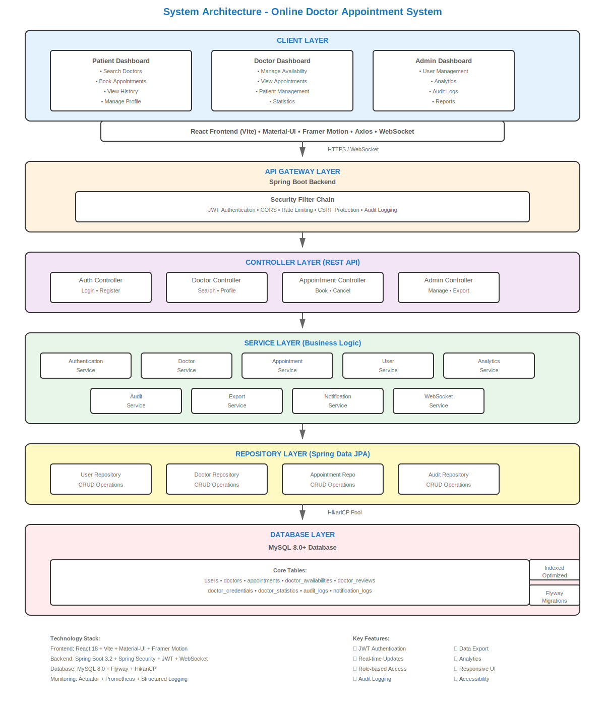

*Complete layered architecture showing the flow from client to database with all major components*


### Frontend Flow

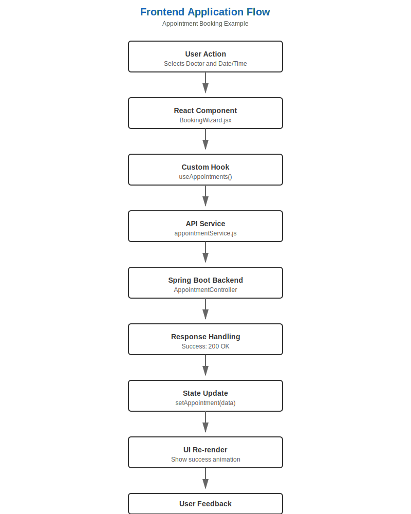

*Detailed flow showing how a user action (booking an appointment) travels through React components, hooks, API services, and back to the UI with state updates*

### Backend Flow

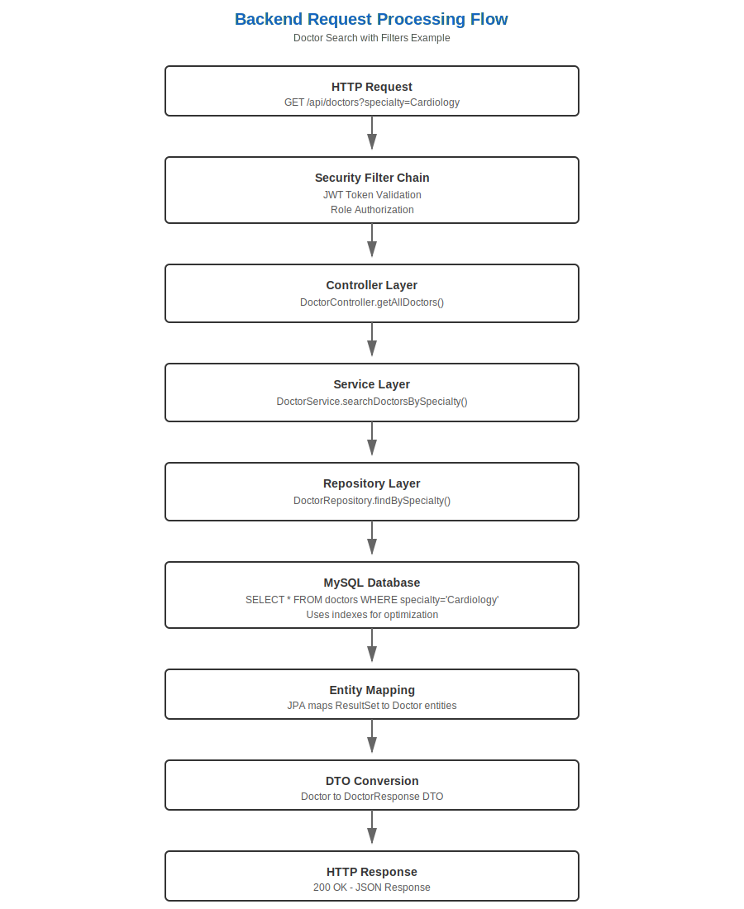

*Complete backend request lifecycle from HTTP request through security filters, controllers, services, repositories, to database and back with response*

### Real-Time Communication Flow

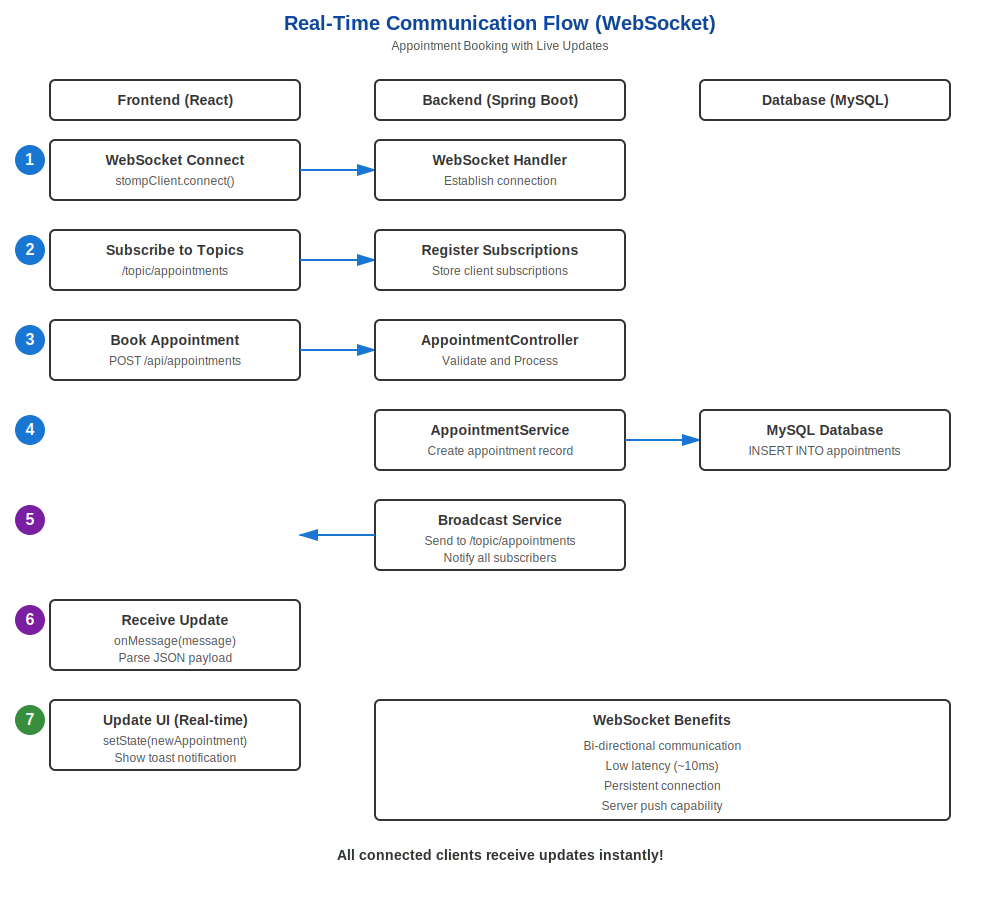

*WebSocket-based real-time communication showing how appointment updates are instantly broadcast to all connected clients (patients, doctors, and admins)*

### Complete System Data Flow

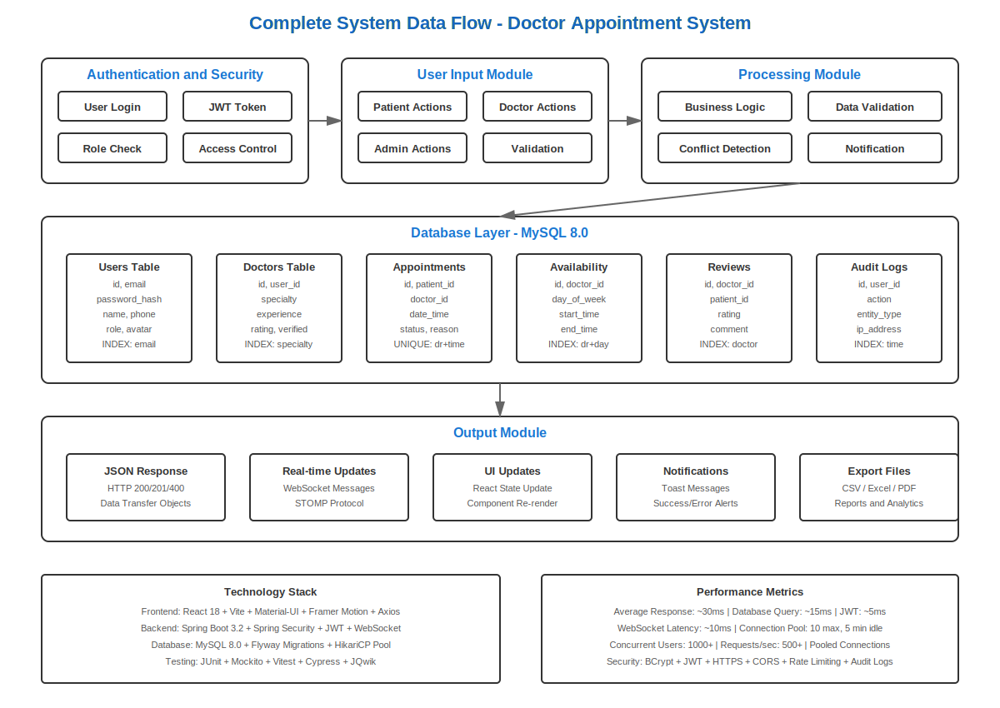

*Comprehensive diagram showing authentication, input processing, database operations, and output generation with technology stack and performance metrics*


---

## 📥 Installation Guide

### Prerequisites

Before you begin, ensure you have the following installed:

- **Java Development Kit (JDK)** 17 or higher
- **Node.js** 16.x or higher and npm
- **MySQL** 8.0 or higher
- **Maven** 3.6 or higher
- **Git** for cloning the repository

### Step 1: Clone the Repository

```bash
git clone https://github.com/MUKUNDKUMAR-G/doctor-appointment-system.git
cd doctor-appointment-system
```


### Step 2: Database Setup

1. **Start MySQL Server**
   ```bash
   # Windows
   net start MySQL80
   
   # Linux/Mac
   sudo systemctl start mysql
   ```

2. **Create Database and User**
   ```sql
   # Login to MySQL
   mysql -u root -p
   
   # Create database
   CREATE DATABASE appointment_system CHARACTER SET utf8mb4 COLLATE utf8mb4_unicode_ci;
   
   # Create user (optional, for production)
   CREATE USER 'appointment_user'@'localhost' IDENTIFIED BY 'your_secure_password';
   GRANT ALL PRIVILEGES ON appointment_system.* TO 'appointment_user'@'localhost';
   FLUSH PRIVILEGES;
   
   # Exit MySQL
   EXIT;
   ```

### Step 3: Backend Setup

1. **Navigate to Backend Directory**
   ```bash
   cd backend
   ```

2. **Configure Database Connection**
   
   Create or edit `src/main/resources/application-dev.yml`:
   ```yaml
   spring:
     datasource:
       url: jdbc:mysql://localhost:3306/appointment_system?useSSL=false&serverTimezone=UTC
       username: root  # or appointment_user
       password: your_password
     jpa:
       hibernate:
         ddl-auto: validate
       show-sql: true
   
   jwt:
     secret: your-secret-key-min-256-bits-long-for-production
     expiration: 86400000  # 24 hours
   ```

3. **Run Database Migrations**
   ```bash
   # Flyway will automatically run migrations on startup
   # Or manually run:
   mvn flyway:migrate
   ```

4. **Build the Backend**
   ```bash
   mvn clean install
   ```

5. **Run the Backend**
   ```bash
   # Development mode
   mvn spring-boot:run -Dspring-boot.run.profiles=dev
   
   ```

   Backend will start on `http://localhost:8080`

### Step 4: Frontend Setup

1. **Navigate to Frontend Directory**
   ```bash
   cd ..  # Back to root
   # Frontend files are in root directory
   ```

2. **Install Dependencies**
   ```bash
   npm install
   ```

3. **Configure Environment Variables**
   
   The `.env.development` file should contain:
   ```env
   VITE_API_BASE_URL=http://localhost:8080/api
   VITE_DEBUG=true
   ```

4. **Run the Frontend**
   ```bash
   # Development mode
   npm run dev
   
   # Or using the batch file (Windows)
   start-frontend.bat
   ```

   Frontend will start on `http://localhost:5173`

### Step 5: Access the Application

1. **Open your browser** and navigate to `http://localhost:5173`

2. **Default Admin Credentials** (created by migration):
   ```
   Email: admin@healthcare.com
   Password: Admin@123
   ```

3. **Register as a Patient** or **Doctor** to explore other features


### Quick Start (All-in-One)

**Windows:**
```bash
# Run both frontend and backend
run-app.bat
```

**Linux/Mac:**
```bash
# Terminal 1 - Backend
cd backend
mvn spring-boot:run -Dspring-boot.run.profiles=dev

# Terminal 2 - Frontend
npm run dev
```

### Troubleshooting

**Port Already in Use:**
```bash
# Backend (8080)
# Windows: netstat -ano | findstr :8080
# Linux/Mac: lsof -i :8080

# Frontend (5173)
# Change port in vite.config.js
```

**Database Connection Failed:**
- Verify MySQL is running
- Check credentials in `application-dev.yml`
- Ensure database `appointment_system` exists

**Flyway Migration Errors:**
```bash
# Check migration status
mvn flyway:info

# Repair if needed
mvn flyway:repair
```

---

## 🔐 Environment Variables

### Backend Environment Variables

Create `backend/src/main/resources/application-dev.yml`:

```yaml
spring:
  datasource:
    url: jdbc:mysql://localhost:3306/appointment_system
    username: ${DB_USERNAME:root}
    password: ${DB_PASSWORD:your_password}
    driver-class-name: com.mysql.cj.jdbc.Driver
    hikari:
      maximum-pool-size: 10
      minimum-idle: 5
      connection-timeout: 30000
  
  jpa:
    hibernate:
      ddl-auto: validate
    show-sql: true
    properties:
      hibernate:
        format_sql: true
        dialect: org.hibernate.dialect.MySQL8Dialect
  
  flyway:
    enabled: true
    baseline-on-migrate: true
    locations: classpath:db/migration

jwt:
  secret: ${JWT_SECRET:your-256-bit-secret-key-change-in-production}
  expiration: 86400000  # 24 hours in milliseconds

file:
  upload-dir: ./uploads
  max-file-size: 5MB

cors:
  allowed-origins: http://localhost:5173,http://localhost:3000

logging:
  level:
    com.healthcare: DEBUG
    org.springframework.security: DEBUG
```

### Frontend Environment Variables

**Development (`.env.development`):**
```env
VITE_API_BASE_URL=http://localhost:8080/api
VITE_WS_BASE_URL=ws://localhost:8080/ws
VITE_DEBUG=true
VITE_ENABLE_ANALYTICS=false
```

**Production (`.env.production`):**
```env
VITE_API_BASE_URL=https://api.yourdomain.com/api
VITE_WS_BASE_URL=wss://api.yourdomain.com/ws
VITE_DEBUG=false
VITE_ENABLE_ANALYTICS=true
```


### Production Environment Variables

For production deployment, set these environment variables:

```bash
# Database
export DB_USERNAME=appointment_user
export DB_PASSWORD=secure_production_password

# JWT
export JWT_SECRET=your-very-long-and-secure-256-bit-secret-key

# CORS
export CORS_ORIGINS=https://yourdomain.com,https://www.yourdomain.com

# Email (if notifications enabled)
export SMTP_HOST=smtp.gmail.com
export SMTP_PORT=587
export SMTP_USERNAME=your-email@gmail.com
export SMTP_PASSWORD=your-app-password

# File Storage
export FILE_UPLOAD_DIR=/var/app/uploads

# Monitoring
export PROMETHEUS_ENABLED=true
```

---

## 📡 API Endpoints

### Authentication Endpoints

| Method | Endpoint | Description | Auth Required |
|--------|----------|-------------|---------------|
| POST | `/api/auth/register` | Register new user | No |
| POST | `/api/auth/login` | User login | No |
| POST | `/api/auth/refresh` | Refresh JWT token | No |
| POST | `/api/auth/logout` | User logout | Yes |
| GET | `/api/auth/validate` | Validate token | Yes |

**Example: Register**
```json
POST /api/auth/register
{
  "email": "patient@example.com",
  "password": "SecurePass@123",
  "firstName": "John",
  "lastName": "Doe",
  "phoneNumber": "+1234567890",
  "role": "PATIENT"
}

Response: 201 Created
{
  "token": "eyJhbGciOiJIUzI1NiIs...",
  "refreshToken": "eyJhbGciOiJIUzI1NiIs...",
  "user": {
    "id": 1,
    "email": "patient@example.com",
    "firstName": "John",
    "lastName": "Doe",
    "role": "PATIENT"
  }
}
```

### Doctor Endpoints

| Method | Endpoint | Description | Auth Required |
|--------|----------|-------------|---------------|
| GET | `/api/doctors` | Get all doctors with filters | No |
| GET | `/api/doctors/{id}` | Get doctor by ID | No |
| GET | `/api/doctors/{id}/profile` | Get enhanced doctor profile | No |
| GET | `/api/doctors/search` | Search doctors | No |
| GET | `/api/doctors/specialties` | Get all specialties | No |
| GET | `/api/doctors/{id}/availability` | Get doctor availability | No |
| GET | `/api/doctors/available-on-date` | Get doctors available on date | No |

**Example: Search Doctors**
```json
GET /api/doctors?specialty=Cardiology&minRating=4&minExperience=5

Response: 200 OK
[
  {
    "id": 1,
    "firstName": "Dr. Sarah",
    "lastName": "Johnson",
    "specialty": "Cardiology",
    "experienceYears": 10,
    "consultationFee": 150.00,
    "rating": 4.8,
    "reviewCount": 245,
    "isAvailable": true,
    "isVerified": true,
    "avatarUrl": "/uploads/avatars/doctor1.jpg",
    "nextAvailableDate": "2024-01-15T09:00:00"
  }
]
```


### Appointment Endpoints

| Method | Endpoint | Description | Auth Required |
|--------|----------|-------------|---------------|
| POST | `/api/appointments/reserve` | Reserve time slot | PATIENT |
| POST | `/api/appointments/{id}/confirm` | Confirm reservation | PATIENT |
| POST | `/api/appointments` | Book appointment directly | PATIENT |
| GET | `/api/appointments/my-appointments` | Get current user appointments | PATIENT |
| GET | `/api/appointments/dashboard` | Get patient dashboard | PATIENT |
| GET | `/api/appointments/doctor/{id}` | Get doctor appointments | DOCTOR/ADMIN |
| DELETE | `/api/appointments/{id}` | Cancel appointment | PATIENT/ADMIN |
| PUT | `/api/appointments/{id}/reschedule` | Reschedule appointment | PATIENT/ADMIN |

**Example: Book Appointment**
```json
POST /api/appointments
Authorization: Bearer {token}
{
  "doctorId": 1,
  "appointmentDateTime": "2024-01-15T10:00:00",
  "reason": "Regular checkup",
  "notes": "First visit",
  "durationMinutes": 30
}

Response: 201 Created
{
  "id": 123,
  "patientName": "John Doe",
  "doctorName": "Dr. Sarah Johnson",
  "appointmentDateTime": "2024-01-15T10:00:00",
  "status": "SCHEDULED",
  "reason": "Regular checkup",
  "durationMinutes": 30
}
```

### Admin Endpoints

| Method | Endpoint | Description | Auth Required |
|--------|----------|-------------|---------------|
| GET | `/api/admin/stats` | Get system statistics | ADMIN |
| GET | `/api/admin/users` | Get all users | ADMIN |
| PUT | `/api/admin/users/{id}/status` | Enable/disable user | ADMIN |
| DELETE | `/api/admin/users/{id}` | Delete user | ADMIN |
| PUT | `/api/admin/doctors/{id}/verify` | Verify doctor | ADMIN |
| GET | `/api/admin/analytics/dashboard` | Get analytics dashboard | ADMIN |
| GET | `/api/admin/audit-logs` | Get audit logs | ADMIN |
| POST | `/api/admin/export/users` | Export users data | ADMIN |
| POST | `/api/admin/export/doctors` | Export doctors data | ADMIN |
| POST | `/api/admin/export/appointments` | Export appointments | ADMIN |

**Example: Get System Statistics**
```json
GET /api/admin/stats
Authorization: Bearer {admin_token}

Response: 200 OK
{
  "totalUsers": 1250,
  "totalDoctors": 85,
  "activeDoctors": 78,
  "totalAppointments": 5420,
  "todayAppointments": 42
}
```

### User Profile Endpoints

| Method | Endpoint | Description | Auth Required |
|--------|----------|-------------|---------------|
| GET | `/api/users/profile` | Get current user profile | Yes |
| PUT | `/api/users/profile` | Update profile | Yes |
| POST | `/api/users/profile/avatar` | Upload avatar | Yes |
| DELETE | `/api/users/profile/avatar` | Delete avatar | Yes |
| PUT | `/api/users/change-password` | Change password | Yes |

### Doctor Profile Endpoints

| Method | Endpoint | Description | Auth Required |
|--------|----------|-------------|---------------|
| GET | `/api/doctor-profile` | Get doctor profile | DOCTOR |
| PUT | `/api/doctor-profile` | Update doctor profile | DOCTOR |
| POST | `/api/doctor-profile/credentials` | Upload credential | DOCTOR |
| GET | `/api/doctor-profile/statistics` | Get statistics | DOCTOR |
| GET | `/api/doctor-profile/reviews` | Get reviews | DOCTOR |


### WebSocket Endpoints

| Endpoint | Description | Subscribe Topic |
|----------|-------------|-----------------|
| `/ws` | WebSocket connection | - |
| `/topic/appointments` | Appointment updates | All users |
| `/topic/doctors` | Doctor updates | All users |
| `/topic/users` | User updates | Admins only |
| `/user/queue/notifications` | Personal notifications | Current user |

**Example: WebSocket Connection**
```javascript
import SockJS from 'sockjs-client';
import { Stomp } from '@stomp/stompjs';

const socket = new SockJS('http://localhost:8080/ws');
const stompClient = Stomp.over(socket);

stompClient.connect({}, () => {
  // Subscribe to appointment updates
  stompClient.subscribe('/topic/appointments', (message) => {
    const update = JSON.parse(message.body);
    console.log('Appointment update:', update);
  });
});
```

---

## 📁 Project Structure

### Frontend Structure

```
src/
├── assets/                      # Static assets
├── components/
│   ├── auth/                   # Authentication components
│   │   ├── ModernLoginForm/
│   │   ├── ModernRegisterForm/
│   │   └── PasswordStrengthIndicator/
│   ├── common/                 # Reusable components
│   │   ├── AnimatedButton/
│   │   ├── ModernCard/
│   │   ├── Toast/
│   │   └── VirtualTable/
│   ├── features/               # Feature-specific components
│   │   ├── BookingWizard/
│   │   ├── DoctorCard/
│   │   ├── AppointmentCard/
│   │   ├── AdminDashboard/
│   │   └── Analytics/
│   └── layout/                 # Layout components
│       ├── Header/
│       ├── MobileNav/
│       └── PageContainer/
├── contexts/                   # React Context providers
│   ├── AuthContext.jsx
│   ├── NotificationContext.jsx
│   ├── ThemeContext.jsx
│   └── RealTimeSyncContext.jsx
├── hooks/                      # Custom React hooks
│   ├── useApi.js
│   ├── useAppointments.js
│   ├── useDebounce.js
│   └── useResponsive.js
├── pages/                      # Page components
│   ├── AuthenticationPage.jsx
│   ├── DashboardPage.jsx
│   ├── DoctorsPage.jsx
│   ├── AppointmentsPage.jsx
│   ├── ProfilePage.jsx
│   ├── AdminDashboardPage.jsx
│   └── NotFoundPage.jsx
├── routes/                     # Routing configuration
│   └── AppRoutes.jsx
├── services/                   # API service layer
│   ├── api.js
│   ├── authService.js
│   ├── doctorService.js
│   ├── appointmentService.js
│   └── websocketService.js
├── styles/                     # Global styles
│   ├── animations.css
│   └── accessibility.css
├── theme/                      # Theme configuration
│   ├── colors.js
│   ├── typography.js
│   └── animations.js
├── utils/                      # Utility functions
│   ├── dateUtils.js
│   ├── validation.js
│   └── constants.js
├── App.jsx                     # Root component
└── main.jsx                    # Entry point
```


### Backend Structure

```
backend/
├── src/
│   ├── main/
│   │   ├── java/com/healthcare/appointmentsystem/
│   │   │   ├── config/                    # Configuration classes
│   │   │   │   ├── SecurityConfig.java
│   │   │   │   ├── JwtConfig.java
│   │   │   │   ├── WebSocketConfig.java
│   │   │   │   ├── CorsConfig.java
│   │   │   │   └── DatabaseConfig.java
│   │   │   ├── controller/                # REST controllers
│   │   │   │   ├── AuthController.java
│   │   │   │   ├── DoctorController.java
│   │   │   │   ├── AppointmentController.java
│   │   │   │   ├── AdminController.java
│   │   │   │   └── UserController.java
│   │   │   ├── dto/                       # Data Transfer Objects
│   │   │   │   ├── AuthRequest.java
│   │   │   │   ├── AuthResponse.java
│   │   │   │   ├── DoctorResponse.java
│   │   │   │   ├── AppointmentRequest.java
│   │   │   │   └── AppointmentResponse.java
│   │   │   ├── entity/                    # JPA entities
│   │   │   │   ├── User.java
│   │   │   │   ├── Doctor.java
│   │   │   │   ├── Appointment.java
│   │   │   │   ├── DoctorAvailability.java
│   │   │   │   ├── DoctorReview.java
│   │   │   │   └── AuditLogEntry.java
│   │   │   ├── repository/                # Data repositories
│   │   │   │   ├── UserRepository.java
│   │   │   │   ├── DoctorRepository.java
│   │   │   │   ├── AppointmentRepository.java
│   │   │   │   └── AuditLogRepository.java
│   │   │   ├── service/                   # Business logic
│   │   │   │   ├── AuthenticationService.java
│   │   │   │   ├── DoctorService.java
│   │   │   │   ├── AppointmentService.java
│   │   │   │   ├── AnalyticsService.java
│   │   │   │   ├── ExportService.java
│   │   │   │   └── AuditLogService.java
│   │   │   ├── exception/                 # Exception handling
│   │   │   │   └── GlobalExceptionHandler.java
│   │   │   ├── migration/                 # Database migration utilities
│   │   │   │   ├── MigrationManager.java
│   │   │   │   └── BackupService.java
│   │   │   └── AppointmentSystemApplication.java
│   │   └── resources/
│   │       ├── db/migration/              # Flyway migrations
│   │       │   ├── V1__Create_initial_schema.sql
│   │       │   ├── V2__Insert_default_data.sql
│   │       │   └── V7__Add_Doctor_Profile_Enhancement_Tables.sql
│   │       ├── application.yml
│   │       ├── application-dev.yml
│   │       └── application-prod.yml
│   └── test/                              # Test files
│       ├── java/
│       └── resources/
├── uploads/                               # File uploads directory
├── pom.xml                                # Maven configuration
└── README.md
```

---

## 📸 Screenshots

### Authentication Flow

#### Login Page
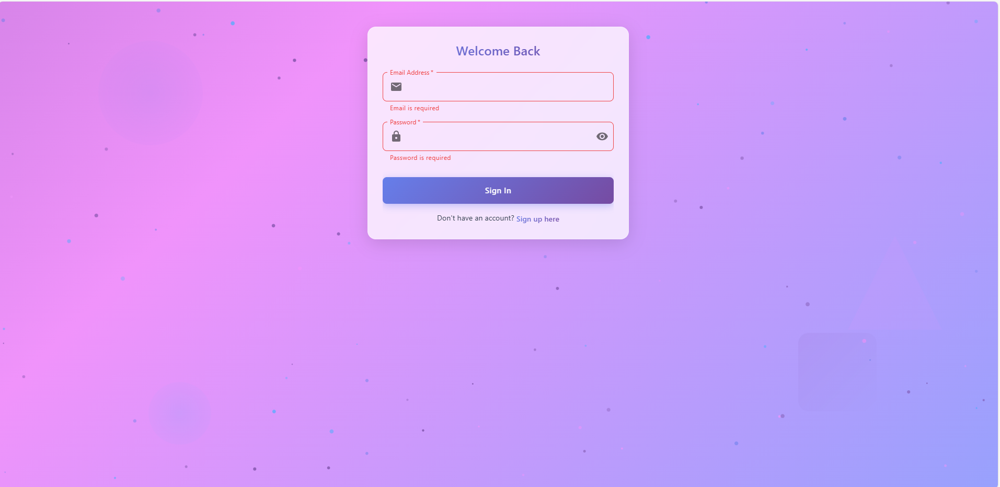
*Modern, secure login with email validation and password strength indicators*

#### Register Page

*User-friendly registration with role selection (Patient/Doctor)*


### Patient Dashboard & Features

#### User Dashboard

*Personalized dashboard showing upcoming appointments, statistics, and quick actions*

#### Doctor Search Page

*Advanced search with filters for specialty, experience, fees, and ratings*

#### Appointment Booking - Step 1: Doctor Selection
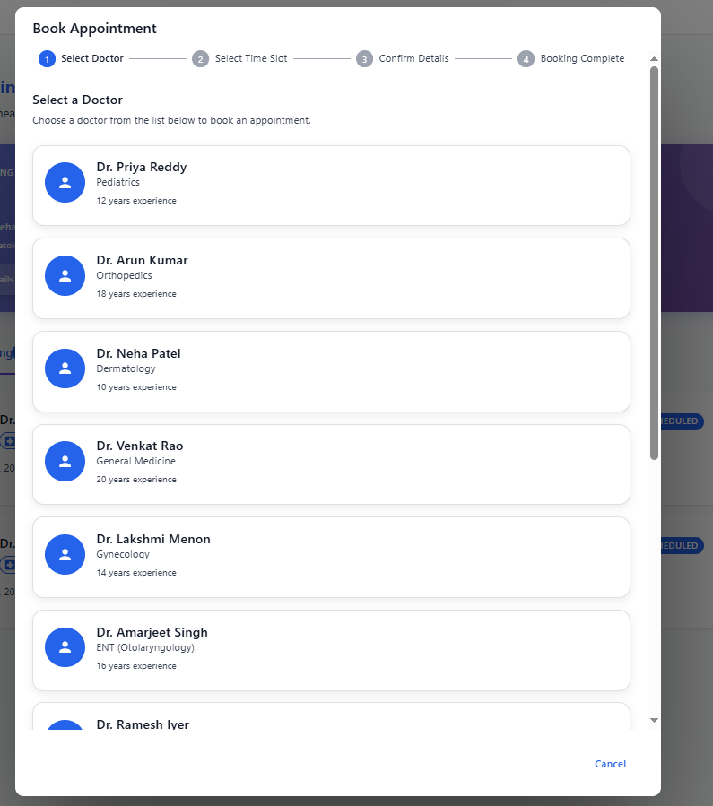
*Select doctor with detailed profile information*

#### Appointment Booking - Step 2: Date & Time Selection
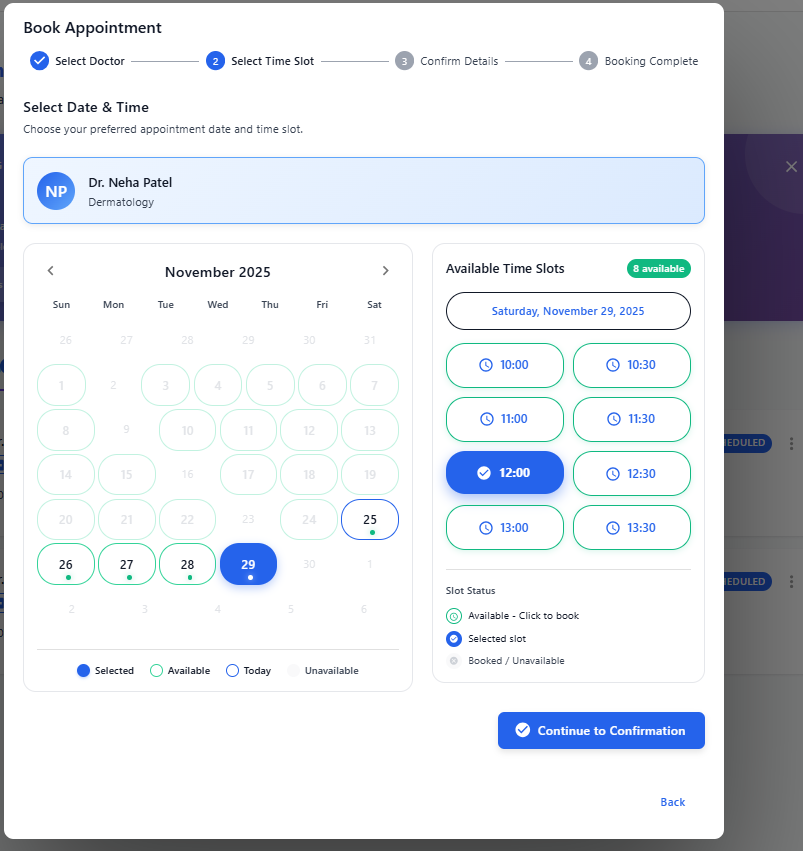
*Interactive calendar with available time slots*

#### Appointment Booking - Step 3: Confirmation
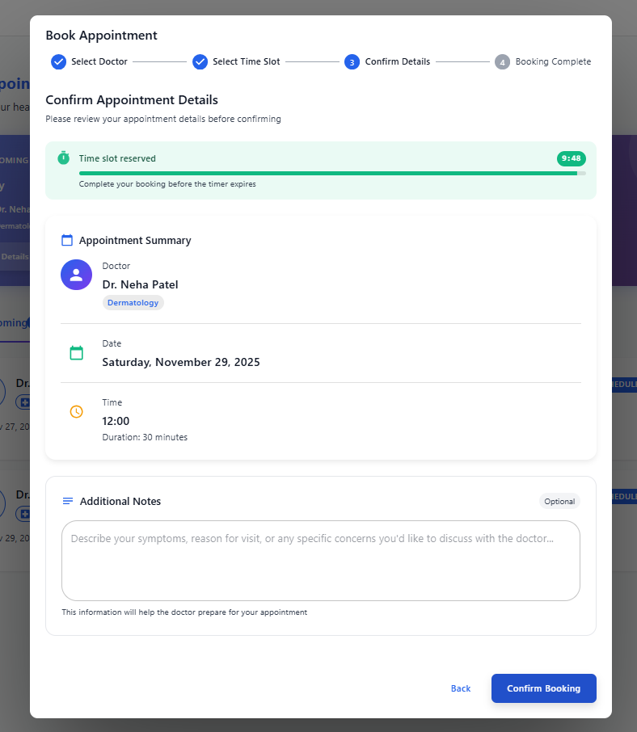
*Review and confirm appointment details*

#### My Appointments
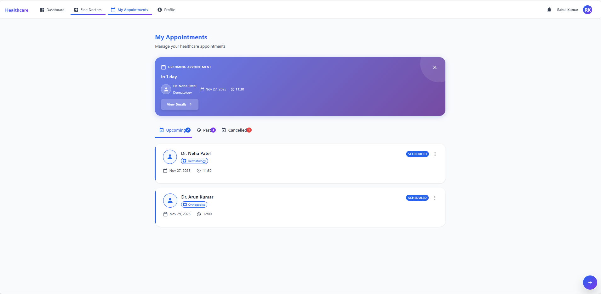
*View, manage, reschedule, or cancel appointments*

#### User Profile
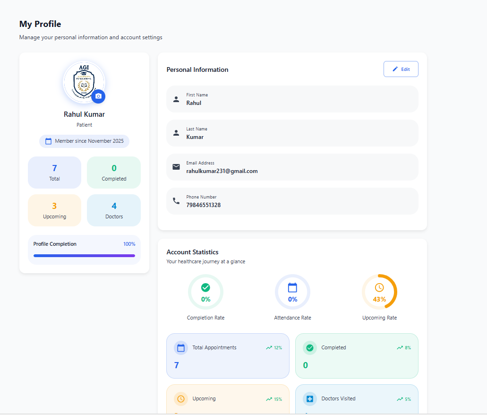
*Manage personal information, avatar, and account settings*

### Doctor Dashboard & Features

#### Doctor Profile Management
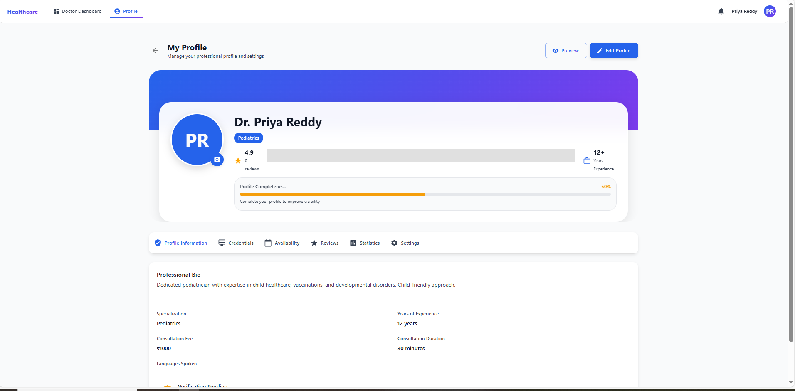
*Comprehensive profile with credentials, availability, and statistics*

#### Doctor Dashboard

*Overview of appointments, patient statistics, and performance metrics*

### Admin Dashboard & Features

#### Admin Home & Dashboard
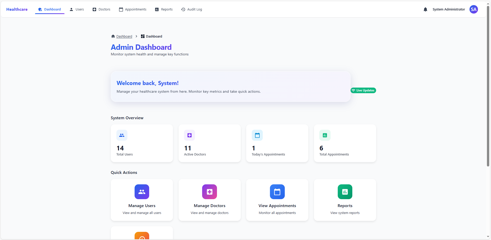
*Real-time system statistics, analytics charts, and quick actions*

#### User Management
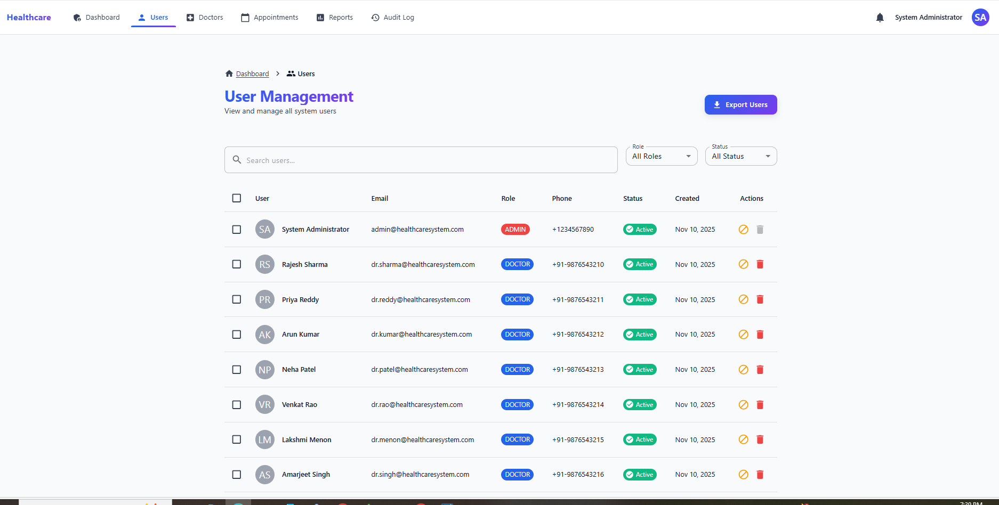
*Manage all users with bulk operations, filtering, and export capabilities*

#### Doctor Management
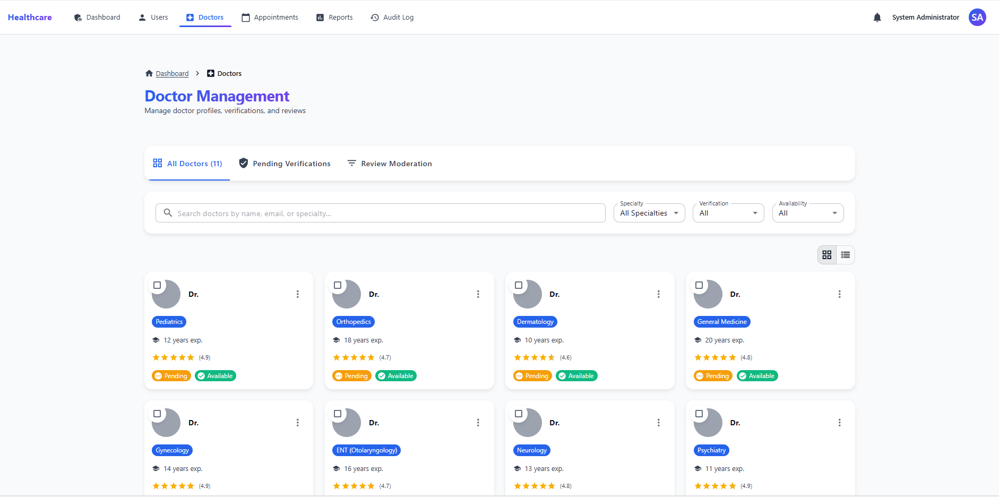
*Verify doctors, manage availability, and view credentials*

#### Reports & Analytics

*Comprehensive analytics with appointment trends, user growth, and performance metrics*

#### Audit Log
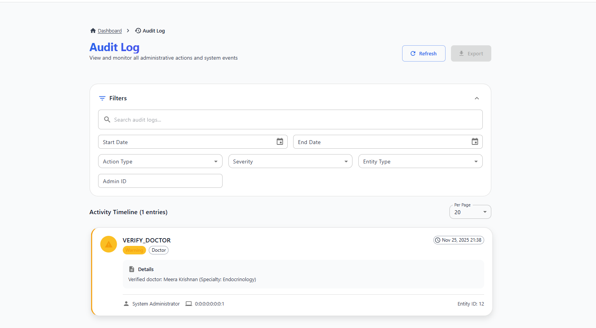
*Complete activity tracking with filtering, search, and export functionality*

---

## 🌟 What Makes This Project Different?

### 1. **Enterprise-Grade Architecture**
- Clean separation of concerns with layered architecture
- RESTful API design following industry best practices
- Microservices-ready structure for future scalability

### 2. **Advanced Security Features**
- JWT-based stateless authentication
- Role-based access control (RBAC) with fine-grained permissions
- Password encryption using BCrypt
- CSRF protection and CORS configuration
- Comprehensive audit logging for compliance
- Rate limiting to prevent abuse


### 3. **Real-Time Communication**
- WebSocket integration using STOMP protocol
- Live appointment updates without page refresh
- Real-time notifications for all user roles
- Instant system-wide broadcasts for critical updates

### 4. **Smart Appointment Management**
- **Time Slot Reservation System** - Prevents double bookings with temporary holds
- **Conflict Detection** - Validates availability before booking
- **Automated Expiration** - Reserved slots auto-release after timeout
- **Flexible Rescheduling** - Easy appointment modifications
- **Cancellation Policies** - Configurable cancellation rules

### 5. **Comprehensive Analytics**
- Real-time dashboard with key metrics
- Appointment trends and forecasting
- User growth analytics
- Doctor performance metrics
- System health monitoring
- Exportable reports in multiple formats (CSV, Excel, PDF)

### 6. **Database Migration Management**
- Flyway integration for version-controlled schema changes
- Automated migration on startup
- Rollback capabilities for safety
- Migration validation and repair tools
- Backup and restore functionality

### 7. **Modern UI/UX**
- Material Design principles with custom theming
- Smooth animations using Framer Motion
- Responsive design for all screen sizes
- Dark mode support (optional)
- Accessibility-first approach (WCAG 2.1 AA)
- Progressive loading with skeletons
- Optimistic UI updates for better perceived performance

### 8. **Performance Optimizations**
- **Frontend:**
  - Code splitting and lazy loading
  - Virtual scrolling for large lists
  - Image optimization and lazy loading
  - Request caching and deduplication
  - Debounced search inputs
  - Memoized components

- **Backend:**
  - HikariCP connection pooling
  - Database query optimization with indexes
  - Caching strategies for frequently accessed data
  - Pagination for large datasets
  - Async processing for heavy operations

### 9. **Developer Experience**
- Comprehensive API documentation
- Consistent code structure and naming conventions
- Extensive inline comments
- Property-based testing for critical logic
- Integration tests for API endpoints
- Hot reload for rapid development
- Detailed error messages and logging

### 10. **Production-Ready Features**
- Docker support for containerization
- Environment-based configuration
- Structured logging with Logback
- Prometheus metrics integration
- Health check endpoints
- Graceful shutdown handling
- File upload with validation
- Multi-format data export

### 11. **Unique Features Not Found in Similar Projects**
- ✅ **Profile Completeness Tracking** - Encourages doctors to complete profiles
- ✅ **Doctor Verification System** - Admin-approved verified badges
- ✅ **Credential Management** - Upload and verify professional documents
- ✅ **Review System** - Patient feedback with ratings
- ✅ **Bulk Operations** - Admin can perform actions on multiple records
- ✅ **Advanced Filtering** - Multi-criteria search with sorting
- ✅ **Audit Trail** - Complete activity history for compliance
- ✅ **Export Functionality** - Data export in CSV, Excel, and PDF
- ✅ **Real-Time Sync** - WebSocket-based live updates
- ✅ **Responsive Analytics** - Interactive charts and visualizations


---

## 🚀 Future Enhancements / Roadmap

### Phase 1: Enhanced Communication (Q1 2024)
- [ ] Email notifications for appointment confirmations
- [ ] SMS reminders for upcoming appointments
- [ ] In-app messaging between patients and doctors
- [ ] Video consultation integration (Zoom/Google Meet)
- [ ] Push notifications for mobile devices

### Phase 2: Advanced Features (Q2 2024)
- [ ] Electronic Health Records (EHR) integration
- [ ] Prescription management system
- [ ] Medical history tracking
- [ ] Lab report uploads and sharing
- [ ] Payment gateway integration (Stripe/PayPal)
- [ ] Insurance verification system
- [ ] Multi-language support (i18n)

### Phase 3: AI & Analytics (Q3 2024)
- [ ] AI-powered doctor recommendations
- [ ] Symptom checker chatbot
- [ ] Predictive analytics for appointment no-shows
- [ ] Automated appointment reminders optimization
- [ ] Sentiment analysis on reviews
- [ ] Demand forecasting for resource planning

### Phase 4: Mobile & Expansion (Q4 2024)
- [ ] Native mobile apps (iOS & Android)
- [ ] Progressive Web App (PWA) support
- [ ] Telemedicine platform integration
- [ ] Multi-clinic/hospital support
- [ ] Pharmacy integration
- [ ] Health insurance claim processing
- [ ] Wearable device integration

### Phase 5: Enterprise Features (2025)
- [ ] Multi-tenant architecture
- [ ] Advanced reporting and BI tools
- [ ] API marketplace for third-party integrations
- [ ] Blockchain for medical records
- [ ] HIPAA compliance certification
- [ ] GDPR compliance tools
- [ ] Advanced security features (2FA, biometric auth)

### Technical Improvements
- [ ] Kubernetes deployment configuration
- [ ] CI/CD pipeline with GitHub Actions
- [ ] Automated testing with 80%+ coverage
- [ ] Performance monitoring with New Relic/Datadog
- [ ] Redis caching layer
- [ ] Elasticsearch for advanced search
- [ ] GraphQL API alternative
- [ ] Microservices architecture migration

---

## 🤝 Contributing

We welcome contributions from the community! Here's how you can help:

### How to Contribute

1. **Fork the Repository**
   ```bash
   git clone https://github.com/MUKUNDKUMAR-G/doctor-appointment-system.git
   cd doctor-appointment-system
   ```

2. **Create a Feature Branch**
   ```bash
   git checkout -b feature/your-feature-name
   ```

3. **Make Your Changes**
   - Follow the existing code style
   - Add tests for new features
   - Update documentation as needed

4. **Commit Your Changes**
   ```bash
   git add .
   git commit -m "feat: add your feature description"
   ```

   **Commit Message Convention:**
   - `feat:` New feature
   - `fix:` Bug fix
   - `docs:` Documentation changes
   - `style:` Code style changes (formatting)
   - `refactor:` Code refactoring
   - `test:` Adding or updating tests
   - `chore:` Maintenance tasks

5. **Push to Your Fork**
   ```bash
   git push origin feature/your-feature-name
   ```

6. **Create a Pull Request**
   - Go to the original repository
   - Click "New Pull Request"
   - Describe your changes in detail
   - Link any related issues


### Contribution Guidelines

- **Code Quality:** Maintain high code quality with proper comments
- **Testing:** Add unit and integration tests for new features
- **Documentation:** Update README and inline documentation
- **Accessibility:** Ensure all UI changes are accessible
- **Performance:** Consider performance implications
- **Security:** Follow security best practices

### Areas We Need Help With

- 🐛 Bug fixes and issue resolution
- ✨ New feature development
- 📝 Documentation improvements
- 🧪 Test coverage expansion
- 🌐 Internationalization (i18n)
- ♿ Accessibility enhancements
- 🎨 UI/UX improvements
- 🔒 Security audits

### Code of Conduct

- Be respectful and inclusive
- Provide constructive feedback
- Focus on the code, not the person
- Help others learn and grow

---

## 📄 License

This project is licensed under the **MIT License** - see the [LICENSE](LICENSE) file for details.

```
MIT License

Copyright (c) 2024 [Your Name]

Permission is hereby granted, free of charge, to any person obtaining a copy
of this software and associated documentation files (the "Software"), to deal
in the Software without restriction, including without limitation the rights
to use, copy, modify, merge, publish, distribute, sublicense, and/or sell
copies of the Software, and to permit persons to whom the Software is
furnished to do so, subject to the following conditions:

The above copyright notice and this permission notice shall be included in all
copies or substantial portions of the Software.

THE SOFTWARE IS PROVIDED "AS IS", WITHOUT WARRANTY OF ANY KIND, EXPRESS OR
IMPLIED, INCLUDING BUT NOT LIMITED TO THE WARRANTIES OF MERCHANTABILITY,
FITNESS FOR A PARTICULAR PURPOSE AND NONINFRINGEMENT. IN NO EVENT SHALL THE
AUTHORS OR COPYRIGHT HOLDERS BE LIABLE FOR ANY CLAIM, DAMAGES OR OTHER
LIABILITY, WHETHER IN AN ACTION OF CONTRACT, TORT OR OTHERWISE, ARISING FROM,
OUT OF OR IN CONNECTION WITH THE SOFTWARE OR THE USE OR OTHER DEALINGS IN THE
SOFTWARE.
```

---

## 👨‍💻 Creator / Maintainer

### **Mukundkumar G**

🎓 **Background:** BCA  
💼 **Role:** Full Stack Developer  
🌐 **Location:** Bengaluru

#### Connect With Me

[](https://github.com/MUKUNDKUMAR-G)
[](https://www.linkedin.com/in/mukundkumar-g/)
[](mailto:mukundkumar3146@gmail.com)


#### About This Project

This project was developed as a comprehensive solution to modernize healthcare appointment management. It demonstrates:

- ✅ Full-stack development expertise (React + Spring Boot)
- ✅ Database design and optimization
- ✅ RESTful API development
- ✅ Real-time communication with WebSockets
- ✅ Security best practices
- ✅ Modern UI/UX design principles
- ✅ Production-ready deployment strategies

**Development Timeline:** Nov 2024 - March 2025
**Lines of Code:** ~50,000+  
**Technologies Used:** 20+ frameworks and libraries


---

## 🙏 Acknowledgments

Special thanks to:

- **Spring Boot Team** - For the excellent framework
- **React Team** - For the powerful UI library
- **Material-UI** - For the beautiful component library
- **MySQL** - For the reliable database system
- **Open Source Community** - For countless libraries and tools

---

## 📞 Support

### Getting Help

- 📖 **Documentation:** Check this README and inline code comments
- 🐛 **Bug Reports:** [Open an issue](https://github.com/MUKUNDKUMAR-G/doctor-appointment-systems/issues)
- 💡 **Feature Requests:** [Submit a feature request](https://github.com/MUKUNDKUMAR-G/doctor-appointment-system/issues)
- 💬 **Discussions:** [Join our discussions](https://github.com/MUKUNDKUMAR-G/doctor-appointment-system/discussions)
- 📧 **Email:** Mukundkumar3146@gmail.com

### Frequently Asked Questions

**Q: Can I use this project for commercial purposes?**  
A: Yes, this project is licensed under MIT License, which allows commercial use.

**Q: How do I deploy this to production?**  
A: Check the deployment guide in the `docs/` folder (coming soon) or contact the maintainer.

**Q: Is this HIPAA compliant?**  
A: This project implements security best practices but has not been officially certified for HIPAA compliance. Additional measures may be required for healthcare production use.

**Q: Can I customize the UI?**  
A: Absolutely! The UI is built with Material-UI and can be easily customized through the theme configuration.

**Q: How do I add a new user role?**  
A: You'll need to update the `UserRole` enum, security configuration, and add appropriate controllers/services.

**Q: Does this support multiple languages?**  
A: Currently, the system is in English. i18n support is planned for future releases.

---

## 📊 Project Statistics


---

## 🌐 Live Demo

**Coming Soon!** A live demo will be available at: [https://demo.appointmentsystem.com](https://demo.appointmentsystem.com)

**Demo Credentials:**
- **Admin:** admin@healthcare.com / Admin@123
- **Doctor:** doctor@healthcare.com / Doctor@123
- **Patient:** patient@healthcare.com / Patient@123

---

<div align="center">

### ⭐ If you find this project helpful, please consider giving it a star!

**Made with ❤️ by Mukundkumar G**

[⬆ Back to Top](#-online-doctor-appointment-system)

</div>
